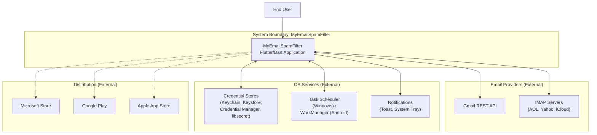
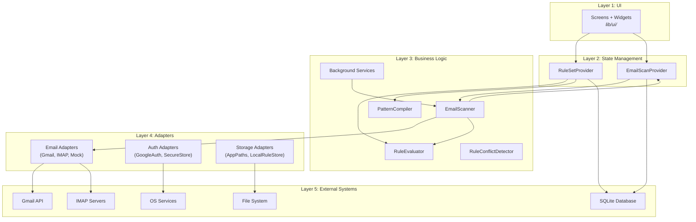
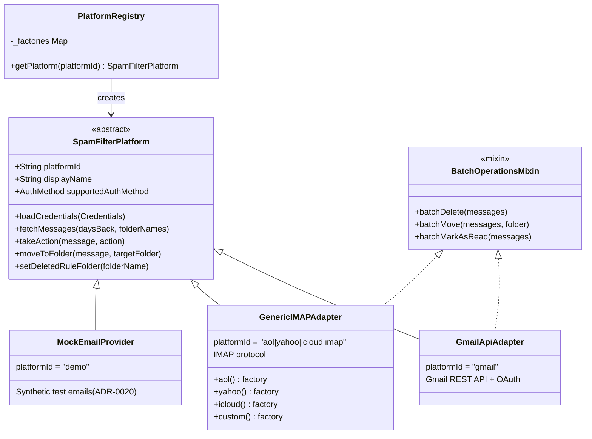
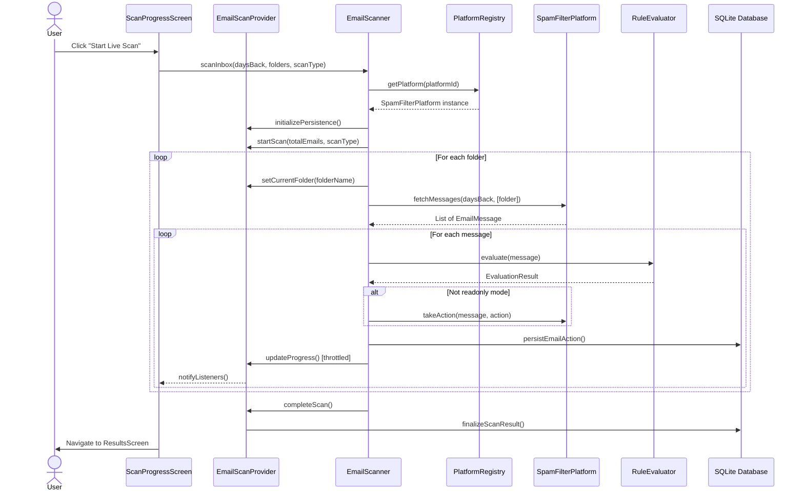
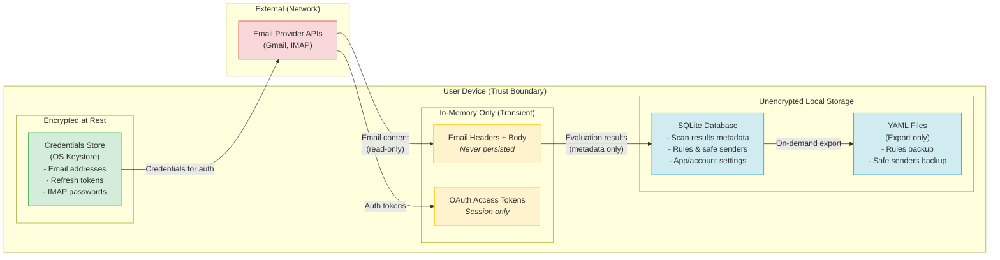

# Architecture Requirements Specification & Design (ARS&D)

## MyEmailSpamFilter -- Cross-Platform Email Spam Filtering Application

---

## Document Control

| Field | Value |
|-------|-------|
| **Document ID** | ARS&D-2026-001 |
| **Version** | 1.0 (Draft) |
| **Date** | 2026-04-03 |
| **Authors** | Harold Kimmey (Product Owner), Claude Code (AI Development Partner) |
| **Status** | Draft |
| **TOGAF Alignment** | Tailored per ADR-2026-04-003 (Combined ADD + ARS with Structured Separation) |
| **Governing ADRs** | See [ADR Index](adr/README.md) for current count and status |

---

## Executive Summary

MyEmailSpamFilter is a cross-platform email spam filtering application built with 100% Flutter/Dart targeting desktop (Windows, macOS, Linux), mobile (Android phone/tablet, iOS phone/tablet), and Chromebook (via Android or Linux targets). The application connects to multiple email providers (Gmail, AOL, Yahoo, iCloud, custom IMAP) through a provider-agnostic adapter architecture, evaluates emails against user-defined regex rules, and takes configurable actions (move to trash, move to folder) with safety-first defaults.

The architecture is governed by [Architecture Decision Records](adr/README.md) that establish core principles: single codebase across all platforms, provider agnosticism via the adapter pattern, local-first privacy with zero telemetry, safety-by-default scan modes, and platform-native integration for credentials, notifications, and background scanning.

**Current State**: See [CHANGELOG.md](../CHANGELOG.md) for current version, sprint, and test status.

**Target State**: Full distribution across Microsoft Store (Windows), Google Play (Android), and Apple App Store (iOS). Responsive design supporting phone, tablet, and desktop form factors. All platforms validated with platform-native integrations where applicable.

**Browser Exclusion**: A browser (Flutter Web) target has been evaluated and excluded. The app relies on IMAP protocol (raw TCP sockets) for AOL, Yahoo, iCloud, and custom IMAP providers, which is incompatible with the browser security model (Same-Origin Policy blocks TCP connections). A browser version would require a server-side IMAP proxy to relay connections, which directly contradicts the app's local-only, zero-telemetry privacy architecture ([ADR-0030](adr/0030-privacy-and-data-governance-strategy.md)). Chromebook users are served by the existing Android (Play Store) and Linux (Crostini) targets.

---

## Stakeholder Map & RACI

| Stakeholder | Role | R | A | C | I |
|-------------|------|---|---|---|---|
| Harold Kimmey | Product Owner, Lead Developer | Architecture, Sprint Planning, Release | All decisions | -- | -- |
| Claude Code (Opus/Sonnet/Haiku) | AI Development Partner | Implementation, Testing, Documentation | -- | Architecture, Sprint Scope | -- |
| End Users | Email account holders | -- | -- | Feature requests, bug reports | Release notes, privacy policy |
| Microsoft Store Review | Platform gatekeeper | -- | -- | -- | MSIX certification (ADR-0036) |
| Google Play Review | Platform gatekeeper | -- | -- | -- | App review, data safety (ADR-0030) |
| Apple App Store Review | Platform gatekeeper | -- | -- | -- | App review (future) |
| Google API Services | Gmail data policy enforcement | -- | -- | -- | OAuth scope verification (ADR-0029) |

**Legend**: R = Responsible, A = Accountable, C = Consulted, I = Informed

---

# PART A: ARCHITECTURE DEFINITION

*Qualitative -- "What does the architecture look like, and why?"*

---

## A1. Scope & Boundaries

### In Scope

- **Platforms**: Desktop (Windows, macOS, Linux), Mobile (Android phone/tablet, iOS phone/tablet), Chromebook (via Android Play Store or Linux Crostini)
- **Email Providers**: Gmail (REST API + OAuth), AOL, Yahoo, iCloud (IMAP), custom IMAP servers, Demo mode
- **Core Function**: Regex-based email spam filtering with configurable rules and safe sender whitelists
- **Processing Model**: Local-only, on-device processing -- no backend server
- **Distribution**: Microsoft Store, Google Play, Apple App Store

### Out of Scope

- Email client replacement (not a mail reader)
- Server-side email processing or filtering
- Machine learning or AI-based classification
- Multi-user or team collaboration features
- Email composition or sending
- **Browser / Flutter Web target**: IMAP protocol requires raw TCP sockets, which browsers block via the Same-Origin Policy. A browser version would require a server-side IMAP proxy, contradicting the local-only privacy architecture (ADR-0030). Chromebook users are served by Android and Linux targets instead.

### System Boundary

The application operates as a client-side tool that authenticates with email providers, reads email metadata/content transiently, evaluates against locally stored rules, and takes actions via provider APIs. No user data leaves the device except for authentication with email providers.



**Reference**: [ADR-0001](adr/0001-flutter-dart-single-codebase.md) (Single Codebase), [ADR-0030](adr/0030-privacy-and-data-governance-strategy.md) (Privacy)

---

## A2. Architecture Principles

Eight governing principles distilled from the [ADR corpus](adr/README.md):

| # | Principle | Description | Governing ADRs |
|---|-----------|-------------|----------------|
| 1 | **Single Codebase** | One Flutter/Dart codebase compiles for all target platforms | [ADR-0001](adr/0001-flutter-dart-single-codebase.md) |
| 2 | **Provider Agnosticism** | Business logic decoupled from email providers via abstract interfaces (`SpamFilterPlatform`) | [ADR-0002](adr/0002-adapter-pattern-email-providers.md) |
| 3 | **Local-First Privacy** | No backend server, no data transmission, no telemetry. All processing on-device. | [ADR-0030](adr/0030-privacy-and-data-governance-strategy.md) |
| 4 | **Safety-by-Default** | Readonly scan mode as default, move-to-trash (not permanent delete), progressive scan modes | [ADR-0006](adr/0006-four-progressive-scan-modes.md), [ADR-0007](adr/0007-move-to-trash-not-permanent-delete.md) |
| 5 | **Platform-Native Integration** | Use OS-native credential stores, notification systems, and schedulers | [ADR-0008](adr/0008-platform-native-secure-credential-storage.md), [ADR-0014](adr/0014-windows-background-scanning-task-scheduler.md), [ADR-0018](adr/0018-windows-toast-notifications-powershell.md), [ADR-0019](adr/0019-windows-system-tray-integration.md) |
| 6 | **Database as Source of Truth** | SQLite is the authoritative store for rules, scan history, and settings. YAML is import/export only. | [ADR-0004](adr/0004-dual-write-sqlite-yaml.md), [ADR-0021](adr/0021-yaml-to-database-one-time-migration.md) |
| 7 | **Testability** | Adapter pattern enables isolated testing. Mock provider for demo mode. 80%+ coverage target. | [ADR-0020](adr/0020-demo-mode-synthetic-emails.md) |
| 8 | **Incremental Delivery** | Sprint-based development with AI model tiering (Haiku/Sonnet/Opus) for task complexity. | [ADR-0016](adr/0016-sprint-model-tiering-haiku-sonnet-opus.md) |

---

## A3. Business Architecture

### Baseline (Current State)

- **Windows**: Production release, Windows Store submission in progress ([ADR-0036](adr/0036-msix-signing-strategy.md))
- **Android**: Development-ready, debug builds on emulator, Google Play submission on hold
- **Gmail**: Dual-path access -- REST API (OAuth) + IMAP (app passwords) per [ADR-0034](adr/0034-gmail-access-method-for-production.md)
- **IMAP Providers**: AOL, Yahoo, iCloud validated
- **Features Delivered**: Multi-account, progressive scan modes ([ADR-0006](adr/0006-four-progressive-scan-modes.md)), background scanning (Windows), safe sender whitelist, rule management, scan history, demo mode, YAML import/export
- See [CHANGELOG.md](../CHANGELOG.md) for current version, sprint, and test count

### Target State

- **8 deployment targets**: Windows desktop, macOS desktop, Linux desktop, Android phone, Android tablet, iOS phone, iOS tablet, Chromebook (via Android/Linux)
- **3 distribution channels**: Microsoft Store, Google Play, Apple App Store
- **Responsive design**: Adaptive layouts for phone, tablet, and desktop form factors
- **Background scanning**: Platform-native on all supported platforms
- **Gmail API verified**: CASA audit when threshold reached (2,500+ users or $5K/yr revenue, per ADR-0029)

### Gap Analysis

| Gap | Baseline | Target | Blocking ADRs | Validated |
|-----|----------|--------|---------------|-----------|
| macOS/Linux not validated | Architecture supports, untested | Validated and distributed | ADR-0001 | Architecture OK |
| iOS (iPhone/iPad) not validated | Architecture supports, untested | Validated and distributed | ADR-0001 | Architecture OK |
| Google Play submission | On hold (Gmail API verification) | Published | ADR-0029, ADR-0034 | Architecture OK |
| Apple App Store | Not started | Published | -- (new ADR needed) | Architecture OK |
| Android tablet layout | Desktop-optimized UI | Responsive tablet layout | -- (new ADR needed) | Architecture OK |
| Flutter Web / Browser | Not started | **Excluded** -- IMAP incompatible with browser security model; server-side proxy contradicts local-only privacy (ADR-0030) | -- | Excluded |
| Chromebook | Not started | Chrome OS via Android or Linux | -- | Via Play Store (Android) or Crostini (Linux) |
| Responsive design | Desktop-optimized UI | Phone/tablet/desktop adaptive | -- (new ADR needed) | Architecture OK |
| Account deletion UI | Not yet built | In-app + web page | ADR-0032 | Decision made |
| Analytics framework | Included but not initialized | Removed | ADR-0033 | Decision made |

### Platform Expansion Validation Notes (April 2026)

**Android (phone + tablet)**: Architecture fully supports both form factors from a single APK/AAB. ADR-0027 (signing) and ADR-0028 (permissions) now Accepted. Remaining gap is responsive UI for tablet screen sizes.

**iOS (iPhone + iPad)**: Flutter compiles natively to iOS. `google_sign_in` has iOS support. Keychain for credentials per ADR-0008. Build pipeline (Xcode + CocoaPods) not yet validated. New ADR needed for Apple App Store submission.

**Browser (Chrome, Edge, Safari)**: **Excluded** after evaluation. Critical incompatibilities:
- `enough_mail` (IMAP): Raw TCP sockets are blocked by browser Same-Origin Policy. IMAP providers (AOL, Yahoo, iCloud) cannot be accessed from a browser without a server-side IMAP proxy.
- A server-side proxy (the approach used by Outlook Web and similar browser-based email clients) would require routing user credentials and email traffic through a backend server, directly contradicting the local-only, zero-telemetry privacy architecture (ADR-0030).
- Secondary blockers: `sqflite`/`sqflite_ffi` have no web support (requires IndexedDB), and `flutter_secure_storage` has limited browser support (weaker than native keystores).
- A Gmail-only browser version is technically feasible (Gmail REST API works over HTTPS) but would exclude all IMAP providers, offering a degraded product that does not justify the additional engineering and maintenance cost.

**Chromebook**: Best path is via existing Android (Play Store) or Linux (Crostini) targets, both of which are already in the architecture. A dedicated Flutter Web target for Chromebook is not necessary and carries the same IMAP blocker as the browser target.

**References**: [ADR-0026](adr/0026-application-identity-and-package-naming.md) through [ADR-0036](adr/0036-msix-signing-strategy.md)

---

## A4. Data Architecture

### Baseline

- **SQLite database** as sole source of truth (see [ADR-0010](adr/0010-normalized-database-schema.md) for schema details)
- **Credentials**: Encrypted at rest via OS-native keystores ([ADR-0008](adr/0008-platform-native-secure-credential-storage.md))
- **Email content**: In-memory only, never persisted ([ADR-0030](adr/0030-privacy-and-data-governance-strategy.md))
- **YAML**: Import/export only, not authoritative ([ADR-0004](adr/0004-dual-write-sqlite-yaml.md))
- **Settings**: Three-tier inheritance -- account -> app -> hardcoded defaults ([ADR-0013](adr/0013-per-account-settings-with-inheritance.md))

### Target

- Same local-only architecture (no cloud sync planned)
- Data deletion capability (in-app + web page, per [ADR-0032](adr/0032-user-data-deletion-strategy.md))
- Firebase Analytics dependency removed ([ADR-0033](adr/0033-analytics-and-crash-reporting-strategy.md))

### Data Classification (per ADR-0030)

| Data Type | Storage | Encrypted | Persisted | Shared |
|-----------|---------|-----------|-----------|--------|
| Email address | flutter_secure_storage | Yes | Yes | No |
| OAuth tokens | flutter_secure_storage | Yes | Yes | No |
| IMAP passwords | flutter_secure_storage | Yes | Yes | No |
| Email headers/body | In-memory only | N/A | No | No |
| Scan result metadata | SQLite | No | Yes | No |
| Spam filter rules | SQLite + YAML export | No | Yes | No |
| Safe sender patterns | SQLite + YAML export | No | Yes | No |
| App/account settings | SQLite | No | Yes | No |

---

## A5. Application Architecture

### Layered Architecture

The application follows a 5-layer architecture with strict dependency direction (top to bottom):



### Adapter Pattern (ADR-0002)



### Design Patterns in Use

| Pattern | Where Used | Purpose | Reference |
|---------|------------|---------|-----------|
| Adapter | SpamFilterPlatform implementations | Unify email provider APIs | ADR-0002 |
| Factory | PlatformRegistry | Provider instantiation by ID | ADR-0002 |
| Provider/Observer | RuleSetProvider, EmailScanProvider | Reactive state management | ADR-0009 |
| Dual-Write | RuleDatabaseStore + LocalRuleStore | SQLite primary, YAML secondary | ADR-0004 |
| Repository | Store classes | Abstract storage layer | ADR-0010 |
| Strategy | RuleEvaluator (AND/OR conditions) | Pluggable matching logic | ADR-0005 |
| Singleton | DatabaseHelper, PatternCompiler | Single instance per lifecycle | ADR-0023 |
| Mixin | BatchOperationsMixin | Reusable batch operations | ADR-0002 |
| Value Object | All models (immutable, copyWith) | Immutable domain entities | -- |

**References**: [ADR-0002](adr/0002-adapter-pattern-email-providers.md), [ADR-0005](adr/0005-safe-senders-evaluated-before-rules.md), [ADR-0009](adr/0009-provider-pattern-state-management.md)

---

## A6. Technology Architecture

### Current Stack

| Layer | Technology | Purpose |
|-------|------------|---------|
| UI Framework | Flutter / Dart | Cross-platform UI and application logic |
| State Management | Provider | Reactive state via ChangeNotifier ([ADR-0009](adr/0009-provider-pattern-state-management.md)) |
| Database | SQLite (sqflite/sqflite_ffi) | Persistent storage ([ADR-0010](adr/0010-normalized-database-schema.md)) |
| Secure Storage | flutter_secure_storage | Credentials via OS-native keystores ([ADR-0008](adr/0008-platform-native-secure-credential-storage.md)) |
| Email (Gmail) | googleapis | Gmail REST API ([ADR-0034](adr/0034-gmail-access-method-for-production.md)) |
| Email (IMAP) | enough_mail | IMAP protocol ([ADR-0002](adr/0002-adapter-pattern-email-providers.md)) |
| OAuth (Mobile) | google_sign_in | Native Google OAuth ([ADR-0011](adr/0011-desktop-oauth-loopback-redirect-pkce.md)) |
| OAuth (Desktop) | flutter_appauth | Browser-based OAuth + PKCE ([ADR-0011](adr/0011-desktop-oauth-loopback-redirect-pkce.md)) |
| Desktop Integration | system_tray, window_manager | Windows system tray and window ([ADR-0019](adr/0019-windows-system-tray-integration.md)) |
| Logging | logger | Keyword-based logging |
| Build Automation | PowerShell (.ps1 scripts) | Windows builds and deployment ([ADR-0017](adr/0017-powershell-build-automation.md)) |
| Packaging | MSIX | Windows Store distribution ([ADR-0036](adr/0036-msix-signing-strategy.md)) |

**Package versions**: See `mobile-app/pubspec.yaml` for current dependency versions.

### Target Additions

| Need | Technology Options | Status | Validated |
|------|--------------------|--------|-----------|
| Responsive framework | Flutter LayoutBuilder + breakpoints | Not started | Architecture OK |
| CI/CD pipeline | GitHub Actions | Not started | -- |
| Linux packaging | Snap, Flatpak, or AppImage | Undecided | Architecture OK |
| iOS/macOS builds | Xcode + CocoaPods | Not validated | Architecture OK |

**Browser / Flutter Web**: Excluded from target additions. IMAP protocol requires raw TCP sockets blocked by browser Same-Origin Policy. A server-side proxy would contradict the local-only privacy architecture (ADR-0030). See [A3 Gap Analysis](#a3-business-architecture) for details.

### Web Platform Dependency Compatibility (Evaluated April 2026 -- Browser Target Excluded)

The following analysis led to the decision to exclude the browser target. Retained for reference.

| Current Dependency | Web Compatible | Web Alternative | Impact |
|--------------------|---------------|-----------------|--------|
| enough_mail (IMAP) | No (TCP sockets blocked) | Server-side IMAP proxy (contradicts ADR-0030) | **Critical**: IMAP providers unavailable without backend |
| sqflite / sqflite_ffi | No | IndexedDB, Hive, or Drift web | Storage layer rewrite for web |
| flutter_secure_storage | Limited | Web Crypto API, sessionStorage | Weaker credential security |
| google_sign_in | Yes | -- | No change needed |
| googleapis | Yes | -- | No change needed |
| system_tray | No | N/A (not applicable to web) | Conditionally excluded |
| window_manager | No | N/A (not applicable to web) | Conditionally excluded |

**Conclusion**: The critical IMAP blocker, combined with the privacy architecture prohibition on server-side proxies, makes the browser target incompatible with the app's core design. See Executive Summary for the full rationale.

**References**: [ADR-0017](adr/0017-powershell-build-automation.md), [ADR-0036](adr/0036-msix-signing-strategy.md)

---

## A7. Architecture Views & Diagrams

Architecture diagrams included in this document:

- **System Context Diagram** (Section A1) -- App boundaries vs external systems
- **Layered Architecture Diagram** (Section A5) -- 5-layer internal structure
- **Adapter Pattern Class Diagram** (Section A5) -- Extensibility model
- **Email Scanning Sequence Diagram** (below) -- Core business flow
- **Data Flow / Privacy Diagram** (below) -- What data goes where
- **Platform Deployment Matrix** (below) -- Cross-cutting platform concerns

### Diagram 4: Email Scanning Sequence



### Diagram 5: Data Flow / Privacy



**Key Privacy Properties**:
- Email content is NEVER persisted -- processed in-memory, discarded after evaluation
- Only evaluation metadata (from address, subject, matched rule) is stored
- No data transmitted to any server other than email providers for authentication
- Zero telemetry, zero analytics, zero tracking (ADR-0030)

### Diagram 6: Platform Deployment Matrix

| Platform | Form Factor | Auth Method | Background Scan | Credential Store | Packaging | Distribution | Status |
|----------|-------------|-------------|-----------------|-----------------|-----------|--------------|--------|
| **Windows** | Desktop | Browser OAuth + PKCE | Task Scheduler (ADR-0014) | Credential Manager | MSIX (ADR-0036) | Microsoft Store | Production |
| **macOS** | Desktop | Browser OAuth | launchd (planned) | Keychain | DMG / App Store | Apple App Store | Not validated |
| **Linux** | Desktop | Browser OAuth | cron / systemd (planned) | libsecret | Snap/Flatpak/AppImage | Direct / Snap Store | Not validated |
| **Android Phone** | Phone | Native google_sign_in | WorkManager (planned) | Keystore | APK/AAB (ADR-0027) | Google Play | Dev-ready |
| **Android Tablet** | Tablet | Native google_sign_in | WorkManager (planned) | Keystore | APK/AAB (ADR-0027) | Google Play | Not validated |
| **iPhone** | Phone | Native google_sign_in | Background App Refresh | Keychain | IPA | Apple App Store | Not validated |
| **iPad** | Tablet | Native google_sign_in | Background App Refresh | Keychain | IPA | Apple App Store | Not validated |
| **Browser** | -- | -- | -- | -- | -- | -- | **Excluded** (IMAP incompatible; server-side proxy contradicts ADR-0030) |
| **Chromebook** | Phone/Tablet/Desktop | Via Android or Linux target | Via Android or Linux target | Via Android or Linux target | APK (Android) or native (Linux) | Google Play / Direct | Via existing targets |

---

## A8. Transition Architectures

### T1: Current State

- Windows production release, Windows Store submission in progress
- Android debug builds on emulator
- Gmail dual-path (REST API for testers, IMAP for general users)
- Background scanning on Windows only
- See [CHANGELOG.md](../CHANGELOG.md) for current version and test status

### T2: Near-Term (Native Desktop + Mobile)

- Windows Store published
- Google Play submitted (pending Gmail API verification strategy)
- macOS and Linux validated and packaged
- Android tablet layout validated
- Account deletion feature (ADR-0032) implemented
- Firebase Analytics removed (ADR-0033)

### T3: Full Native Platforms

- iOS (iPhone + iPad) validated and submitted to Apple App Store
- Background scanning on Android (WorkManager) and macOS (launchd)
- Responsive design for phone/tablet/desktop form factors
- Gmail API CASA verification (if threshold met per ADR-0029)

### T4: Chromebook & Full Platform Matrix

- **Chromebook**: Deployed via Android (Play Store) and/or Linux (Crostini) -- no Flutter Web build required
- **Browser**: Excluded from the platform matrix. IMAP protocol requires raw TCP sockets incompatible with browser Same-Origin Policy. The only viable approach (a server-side IMAP proxy, as used by browser-based email clients like Outlook Web) would route user credentials and email content through a backend server, directly contradicting the local-only, zero-telemetry privacy architecture (ADR-0030). Chromebook coverage eliminates the primary use case for a browser target.
- Full responsive design across all form factors

---

# PART B: REQUIREMENTS SPECIFICATION

*Quantitative -- "What must the implementation achieve, and how will we measure compliance?"*

---

## B1. Success Measures & KPIs

| KPI | Target | Measurement Method |
|-----|--------|-------------------|
| Test count | No regression (monotonically increasing) | `flutter test` |
| New code coverage | 80%+ for new code | `flutter test --coverage` |
| Pattern evaluation (cached) | < 0.5ms (10 patterns) | Stopwatch timing |
| DB indexed query | < 5ms | Stopwatch timing |
| Memory (typical ruleset, <500 patterns) | < 10MB | Task Manager / DevTools |
| Memory (large ruleset, 5000 patterns) | < 50MB | Task Manager / DevTools |
| App startup (cold) | < 3 seconds (release build) | Stopwatch timing |
| Scan throughput | < 2ms/email overhead | Stopwatch timing |
| UI update frequency | Per [ADR-0022](adr/0022-throttled-ui-progress-updates.md) | ADR-defined thresholds |
| Store certification | Pass on first submission | Store review feedback |

**Current baselines and detailed metrics**: See [PERFORMANCE_BENCHMARKS.md](PERFORMANCE_BENCHMARKS.md)

---

## B2. Business Requirements

| ID | Requirement | Acceptance Criteria | ADR Reference |
|----|-------------|---------------------|---------------|
| BR-1 | Multi-provider email filtering | Gmail, AOL, Yahoo, iCloud, custom IMAP, Demo mode all functional | [ADR-0002](adr/0002-adapter-pattern-email-providers.md) |
| BR-2 | Four progressive scan modes | readonly (default), testLimit, testAll, fullScan with enforcement | [ADR-0006](adr/0006-four-progressive-scan-modes.md) |
| BR-3 | Safe sender whitelist | Safe senders evaluated before rules, pattern type detection | [ADR-0005](adr/0005-safe-senders-evaluated-before-rules.md) |
| BR-4 | Multi-account support | Per-account settings with 3-tier inheritance | [ADR-0013](adr/0013-per-account-settings-with-inheritance.md) |
| BR-5 | Demo mode | Synthetic emails across multiple categories, no live account needed | [ADR-0020](adr/0020-demo-mode-synthetic-emails.md) |
| BR-6 | Background scanning | Platform-native scheduling (Windows: Task Scheduler) | [ADR-0014](adr/0014-windows-background-scanning-task-scheduler.md) |
| BR-7 | Move-to-trash safety | All "delete" actions move to trash (recoverable), not permanent delete | [ADR-0007](adr/0007-move-to-trash-not-permanent-delete.md) |
| BR-8 | Scan history | Persistent scan results with retention settings | [ADR-0010](adr/0010-normalized-database-schema.md) |
| BR-9 | YAML import/export | Rules and safe senders exportable to YAML for version control | [ADR-0004](adr/0004-dual-write-sqlite-yaml.md) |

**Assumptions**: Users have direct email account access. Single-user per device. Internet required for email scanning.

**Constraints**: No server-side component. Must pass store review for privacy and security.

---

## B3. Data Requirements

| ID | Requirement | Acceptance Criteria | ADR Reference |
|----|-------------|---------------------|---------------|
| DR-1 | All user data stored locally | No data transmitted to any server except email providers for auth | [ADR-0030](adr/0030-privacy-and-data-governance-strategy.md) |
| DR-2 | Credentials encrypted at rest | OS-native keystore on every platform | [ADR-0008](adr/0008-platform-native-secure-credential-storage.md) |
| DR-3 | Email content never persisted | In-memory only during evaluation, discarded after | [ADR-0030](adr/0030-privacy-and-data-governance-strategy.md) |
| DR-4 | Non-destructive schema migrations | All migrations wrapped in transactions, idempotent | [ADR-0021](adr/0021-yaml-to-database-one-time-migration.md) |
| DR-5 | User data deletion on request | In-app + web page deletion within 30 days | [ADR-0032](adr/0032-user-data-deletion-strategy.md) |
| DR-6 | Regex-only patterns | All rule patterns are regex, case-insensitive | [ADR-0003](adr/0003-regex-only-pattern-matching.md) |
| DR-7 | Canonical folder mapping | Provider-specific folder names normalized to standard set | [ADR-0024](adr/0024-canonical-folder-mapping.md) |

---

## B4. Application Requirements

| ID | Requirement | Acceptance Criteria | ADR Reference |
|----|-------------|---------------------|---------------|
| AR-1 | Single codebase for all platforms | Flutter/Dart compiles for all targets from one source tree | [ADR-0001](adr/0001-flutter-dart-single-codebase.md) |
| AR-2 | Adapter interface compliance | New providers implement SpamFilterPlatform; existing tests pass | [ADR-0002](adr/0002-adapter-pattern-email-providers.md) |
| AR-3 | Reactive UI updates | Provider pattern with ChangeNotifier for all state changes | [ADR-0009](adr/0009-provider-pattern-state-management.md) |
| AR-4 | Throttled progress updates | Dual-threshold notification per [ADR-0022](adr/0022-throttled-ui-progress-updates.md) | [ADR-0022](adr/0022-throttled-ui-progress-updates.md) |
| AR-5 | Pattern compilation caching | HashMap cache for repeated patterns (see [ADR-0023](adr/0023-in-memory-pattern-caching.md) for benchmarks) | [ADR-0023](adr/0023-in-memory-pattern-caching.md) |
| AR-6 | Trash safety enforcement | All delete actions use move-to-trash, never permanent delete | [ADR-0007](adr/0007-move-to-trash-not-permanent-delete.md) |
| AR-7 | Responsive design | Adaptive layouts for phone (<600dp), tablet (600-900dp), desktop (>900dp) | -- (new requirement) |
| AR-8 | Accessibility (WCAG 2.1 AA) | Semantics labels on interactive elements, 48dp touch targets, SelectionArea for copyable text, theme colors for dark mode | [ADR-0037](adr/0037-ui-accessibility-standards.md) |
| AR-9 | YAML round-trip invariant | Rule export -> user edit -> re-import preserves patternCategory, patternSubType, sourceDomain | [ADR-0037](adr/0037-ui-accessibility-standards.md) |

---

## B5. Technology Requirements

| ID | Requirement | Acceptance Criteria | ADR Reference |
|----|-------------|---------------------|---------------|
| TR-1 | Flutter 3.x / Dart 3.x | Minimum framework version for all builds | [ADR-0001](adr/0001-flutter-dart-single-codebase.md) |
| TR-2 | SQLite storage | sqflite (mobile), sqflite_ffi (desktop), TBD (web) | [ADR-0010](adr/0010-normalized-database-schema.md) |
| TR-3 | OAuth 2.0 with PKCE | Desktop OAuth uses browser-based flow with loopback redirect | [ADR-0011](adr/0011-desktop-oauth-loopback-redirect-pkce.md) |
| TR-4 | MSIX packaging | Windows Store distribution with auto-signing | [ADR-0036](adr/0036-msix-signing-strategy.md) |
| TR-5 | PowerShell build automation | All Windows build scripts in PowerShell | [ADR-0017](adr/0017-powershell-build-automation.md) |
| TR-6 | ~~Flutter Web compilation~~ | ~~Chrome, Edge, Safari support~~ | Excluded (IMAP incompatible with browser; see A1 Out of Scope) |

---

## B6. Interoperability Requirements

| ID | External System | Protocol/API | Integration Pattern | ADR Reference |
|----|----------------|-------------|--------------------|----|
| IR-1 | Gmail | REST API v1 (googleapis package) | GmailApiAdapter | [ADR-0002](adr/0002-adapter-pattern-email-providers.md), [ADR-0034](adr/0034-gmail-access-method-for-production.md) |
| IR-2 | AOL, Yahoo, iCloud | IMAP (enough_mail package) | GenericIMAPAdapter | [ADR-0002](adr/0002-adapter-pattern-email-providers.md) |
| IR-3 | Windows Task Scheduler | COM API via PowerShell | WindowsTaskSchedulerService | [ADR-0014](adr/0014-windows-background-scanning-task-scheduler.md) |
| IR-4 | OS Credential Stores | Platform-native APIs | flutter_secure_storage | [ADR-0008](adr/0008-platform-native-secure-credential-storage.md) |
| IR-5 | YAML files | YAML 1.1 | YamlService, YamlExportService | [ADR-0004](adr/0004-dual-write-sqlite-yaml.md) |

---

## B7. Implementation Guidelines

| Area | Standard | Reference Document |
|------|----------|--------------------|
| Code quality | 0 analyzer warnings (`flutter analyze`) | [QUALITY_STANDARDS.md](QUALITY_STANDARDS.md) |
| Testing | TDD approach, 80%+ coverage for new code | [TESTING_STRATEGY.md](TESTING_STRATEGY.md) |
| Logging | Keyword-based via AppLogger (EMAIL, RULES, EVAL, DB, AUTH, SCAN, ERROR, PERF, UI, DEBUG) | [LOGGING_CONVENTIONS.md](LOGGING_CONVENTIONS.md) |
| Branching | GitFlow: main <- develop <- feature | [ADR-0015](adr/0015-gitflow-branching-strategy.md) |
| Changelog | Updated per commit with user-facing changes | [ADR-0025](adr/0025-changelog-per-commit-policy.md) |
| Sprint process | Phases 1-7 with model tiering | [SPRINT_EXECUTION_WORKFLOW.md](SPRINT_EXECUTION_WORKFLOW.md) |
| Documentation | No contractions, no emojis, Logger not print() | CLAUDE.md |

---

## B8. Conformance & Compliance Criteria

| ID | Compliance Area | Requirement | Status | ADR Reference |
|----|----------------|-------------|--------|---------------|
| CC-1 | Google API Services User Data Policy | Minimum scopes, no selling data, delete on request | Compliant by design | [ADR-0029](adr/0029-gmail-api-scope-and-verification-strategy.md), [ADR-0030](adr/0030-privacy-and-data-governance-strategy.md) |
| CC-2 | Microsoft Store certification | MSIX signed, privacy policy linked, content rating | In progress | [ADR-0036](adr/0036-msix-signing-strategy.md) |
| CC-3 | Google Play privacy policy | Publicly accessible, consistent with Data Safety form | Policy drafted | [ADR-0030](adr/0030-privacy-and-data-governance-strategy.md) |
| CC-4 | GDPR/CCPA | Local-only processing, data deletion on request, no tracking | Compliant by design | [ADR-0030](adr/0030-privacy-and-data-governance-strategy.md), [ADR-0032](adr/0032-user-data-deletion-strategy.md) |
| CC-5 | Gmail API CASA audit | Required when >2,500 users or >$5K/yr revenue | Deferred | [ADR-0029](adr/0029-gmail-api-scope-and-verification-strategy.md) |
| CC-6 | Android permissions | Minimum required permissions, runtime requests | Defined | [ADR-0028](adr/0028-android-permission-strategy.md) |
| CC-7 | Android release signing | Play App Signing enrollment | Defined | [ADR-0027](adr/0027-android-release-signing-strategy.md) |

---

# PART C: TRACEABILITY & GOVERNANCE

---

## C1. Decision-to-Requirement Traceability Matrix

### Domain-Level View

[ADRs](adr/README.md) grouped into 7 architectural domains, mapped to requirements sections:

| Domain | ADRs | B2 Business | B3 Data | B4 Application | B5 Technology | B6 Interop | B8 Compliance |
|--------|------|-------------|---------|----------------|---------------|------------|---------------|
| **Core Architecture** (9) | 0001, 0002, 0003, 0005, 0006, 0007, 0009, 0022, 0023 | BR-1,2,3,7 | DR-6 | AR-1,2,3,4,5,6 | TR-1 | IR-1,2 | -- |
| **Data & Storage** (6) | 0004, 0010, 0012, 0013, 0021, 0024 | BR-4,8,9 | DR-4,7 | -- | TR-2 | IR-5 | -- |
| **Security & Auth** (2) | 0008, 0011 | -- | DR-2 | -- | TR-3 | IR-4 | -- |
| **Platform Integration** (6) | 0014, 0017, 0018, 0019, 0020, 0035 | BR-5,6 | -- | -- | TR-4,5 | IR-3 | -- |
| **Privacy & Compliance** (5) | 0029, 0030, 0032, 0033, 0034 | -- | DR-1,3,5 | -- | -- | -- | CC-1,3,4,5 |
| **Release & Distribution** (7) | 0026, 0027, 0028, 0031, 0036 + 0015, 0025 | -- | -- | -- | TR-4 | -- | CC-2,6,7 |
| **DevOps & Process** (1) | 0016 | -- | -- | -- | -- | -- | -- |

---

## C2. Gap-to-Requirement Mapping

| Gap (from A3-A6) | Requirement(s) Addressing It | Priority |
|-------------------|------------------------------|----------|
| macOS/Linux/iOS not validated | AR-1, TR-1 | Medium |
| Google Play submission on hold | CC-1, CC-3, CC-5, CC-6, CC-7 | Medium (blocked on ADR-0029) |
| Apple App Store not started | New ADR needed | Low |
| Flutter Web / Browser | -- | Excluded (IMAP incompatible; server-side proxy contradicts ADR-0030) |
| Chromebook | -- | Low (served by Android/Linux targets) |
| Responsive design not started | AR-7 (new) | Medium |
| Account deletion UI | DR-5, CC-4 | Medium |
| Analytics dependency cleanup | CC-3 (Data Safety form) | Low |
| Pattern cache unbounded | AR-5 (known issue #16) | Low |
| No CI/CD pipeline | -- (efficiency, not architectural) | Low |

---

## C3. Risk Register

| ID | Risk | Impact | Likelihood | Mitigating ADR(s) | Mitigation Strategy |
|----|------|--------|------------|-------------------|---------------------|
| R1 | Gmail API verification rejected | Cannot distribute on Play Store with OAuth | Medium | ADR-0029, ADR-0034 | Dual-path: IMAP app passwords as fallback |
| R2 | Store certification failure | Delayed distribution | Low | ADR-0030, ADR-0036 | Privacy-by-design, pre-certification testing |
| R3 | Pattern cache memory growth | OOM on large rulesets | Low | ADR-0023 | LRU cache planned (Issue #16) |
| R4 | IMAP provider API changes | Provider adapter breaks | Low | ADR-0002 | Adapter isolation limits blast radius |
| R5 | Credential storage breach | User account compromise | Low | ADR-0008 | OS-native encryption, no custom crypto |
| R6 | Migration data loss | Rules lost on upgrade | Low | ADR-0021 | Transaction-wrapped, idempotent migrations |
| R7 | Browser IMAP incompatibility | IMAP providers unavailable in browser (TCP sockets blocked by Same-Origin Policy) | **Resolved** | ADR-0002, ADR-0030 | Browser target excluded; server-side proxy contradicts local-only privacy architecture |
| R8 | Browser storage/credential limits | sqflite incompatible with web; credentials weaker than native keystores | **Resolved** | ADR-0008, ADR-0010 | Browser target excluded; no web storage or credential adaptation needed |
| R9 | Tablet UX inadequate | Poor user experience on tablets | Low | -- | Responsive breakpoints, adaptive layouts |

---

## C4. Change Log & Requirements Impact History

| Date | Change | Impact | Sections Affected |
|------|--------|--------|-------------------|
| 2026-04-03 | Initial ARS&D document created | Baseline established | All |
| 2026-04-10 | Review pass 1: corrected ADR counts, table counts | Accuracy fixes | Executive Summary, A2, A4, A6, Appendix D |
| 2026-04-10 | Deduplicated counts across ARSD/ARCHITECTURE/ADR docs | Maintenance reduction | All sections with counts |
| 2026-04-10 | Platform expansion validation for Android, iOS, Browser, Chromebook | Browser target blocked (IMAP incompatible); Chromebook served by Android/Linux | A3, A4, A6, A8, C2, C3, Diagram 6 |
| 2026-04-11 | Browser target formally excluded | Moved from "Blocked" to "Excluded"; IMAP+privacy rationale documented across ARSD, ARCHITECTURE, ADR-0001, ADR-0030 | Exec Summary, A1, A3, A4, A6, A8, B5, C2, C3, Diagram 6 |

---

# APPENDICES

---

## Appendix A: Glossary

| Term | Definition |
|------|-----------|
| **SpamFilterPlatform** | Abstract class defining the email provider interface (ADR-0002) |
| **PlatformRegistry** | Factory that instantiates email provider adapters by platform ID |
| **EvaluationResult** | Value object containing the outcome of evaluating one email against all rules |
| **ScanMode** | Enum: readonly, testLimit, testAll, fullScan (ADR-0006) |
| **CanonicalFolder** | Normalized folder names across providers: INBOX, JUNK, TRASH, SENT, DRAFTS, ARCHIVE, CUSTOM |
| **Dual-Write** | Pattern where data is written to SQLite (primary) and YAML (secondary) simultaneously |
| **Safe Sender** | A regex pattern on the whitelist; emails from matching senders bypass all rules |
| **PatternCompiler** | Service that compiles and caches regex patterns for efficient matching ([ADR-0023](adr/0023-in-memory-pattern-caching.md)) |
| **Three-Tier Settings** | Inheritance chain: account_settings -> app_settings -> hardcoded defaults |
| **CASA** | Cloud Application Security Assessment, required for Gmail API restricted scopes at scale |
| **ARS&D** | Architecture Requirements Specification & Design (this document) |

---

## Appendix B: Reference Models

### SpamFilterPlatform Interface

The primary architectural building block. All email providers must implement this interface. See [ADR-0002](adr/0002-adapter-pattern-email-providers.md) for full specification.

### PlatformRegistry Factory Map

```
'aol'    -> GenericIMAPAdapter.aol()
'gmail'  -> GmailApiAdapter()
'yahoo'  -> GenericIMAPAdapter.yahoo()
'icloud' -> GenericIMAPAdapter.icloud()
'imap'   -> GenericIMAPAdapter.custom()
'demo'   -> MockEmailProvider()
```

### Three-Tier Settings Inheritance

```
Query: getSettingValue(accountId, key)
  1. Check account_settings[accountId][key]  -> if found, return
  2. Check app_settings[key]                 -> if found, return
  3. Return hardcoded default                -> always available
```

See [ADR-0013](adr/0013-per-account-settings-with-inheritance.md) for details.

---

## Appendix C: Rule Evaluation Algorithm

```
evaluate(EmailMessage):
  1. SafeSenderList.findMatch(email.from)
     -> Match? Return safeSender result (STOP)
  2. For each Rule (sorted by executionOrder):
     a. Check exceptions first
        -> Exception matched? Skip this rule (CONTINUE)
     b. Check conditions (AND/OR logic)
        -> Conditions matched? Return action result (STOP)
  3. No match -> Return noMatch result
```

See [ADR-0005](adr/0005-safe-senders-evaluated-before-rules.md) for rationale.

---

## Appendix D: ADR Index

For the complete ADR index with current status, see [docs/adr/README.md](adr/README.md).

The domain groupings used in the [C1 Traceability Matrix](#c1-decision-to-requirement-traceability-matrix) are:

| Domain | ADR Range | Purpose |
|--------|-----------|---------|
| Core Architecture | 0001-0009, 0022-0023 | Fundamental design patterns and principles |
| Data & Storage | 0004, 0010, 0012-0013, 0021, 0024 | Database, file system, settings |
| Security & Auth | 0008, 0011 | Credential storage and OAuth |
| Platform Integration | 0014, 0017-0020, 0035 | OS-specific features |
| Privacy & Compliance | 0029-0030, 0032-0034 | Privacy, compliance, Gmail access |
| Release & Distribution | 0015, 0025-0028, 0031, 0036 | Build, packaging, store submission |
| DevOps & Process | 0016 | Sprint methodology |

---

**Document End**

*This ARS&D document is a TOGAF-tailored deliverable per [ADR-2026-04-003](). It combines the Architecture Definition Document (ADD) and Architecture Requirements Specification (ARS) with structured separation (Part A / Part B / Part C). Individual ADRs remain the authoritative source for specific architectural decisions.*
